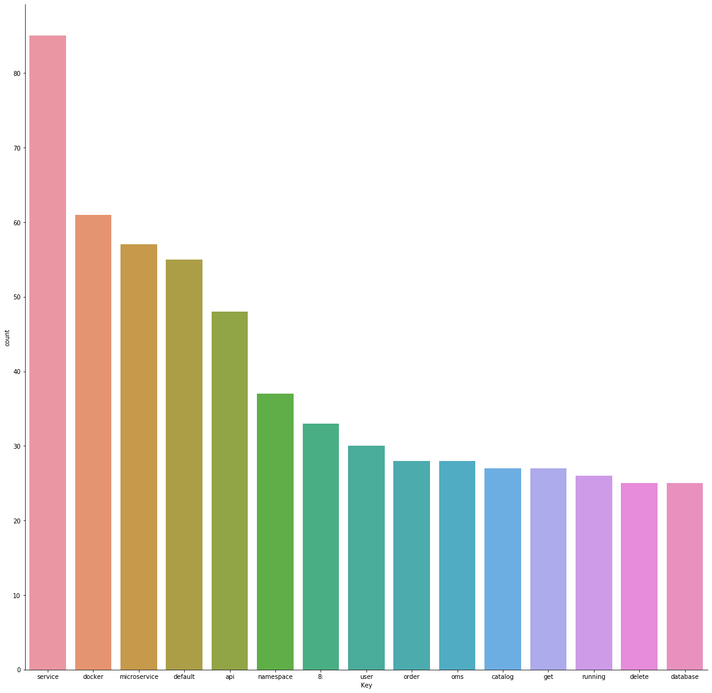

# Commonalities of Microservice-based applications
To try understand how microservices combined manually together into an application. The goal of this exercise is to identify common patterns and commonly used components in the process of building microservice-based applications in order to automate and simplify the process.

## Methodology

I worked on a sample of 100 open source applications that were found mainly from GitHub. I then saved the urls into a csv file which I used as input file to a python program that search for images in the GitHub repos of the 100 apps, extract texts from the found images using google vision api and produce a data visualization bar chart that shows the texts that are used the most from the found images.

## Search criteria

I used the following keywords:

"Microservice AND application" OR
"Microservice AND architecture"

I ultimately selected applications that met the above criteria AND in additon had an architecture diagram.

## URLs crawling

I uploaded the csv (microservice_based_apps.csv) file containing the urls of my sampe of 100 applications into my Gdrive which I then mounted into my python program which I run on Jupyter notebook of Google Colaboratory. 
I used pandas and Beautifulsoup libraries to read the URLs from the csv file and retrieve the images. See code snippet below:

	repo_links = pd.read_csv('microservice_based_apps.csv')
	images = []
	#print(repo_links['source'].dtypes)
	for link in repo_links['source']:
	    print(link)
	    html_page = urllib2.urlopen(link)
	    soup = BeautifulSoup(html_page)
	    images.append([])
	    for img in soup.findAll('img'):
	        #print(img)
	        images[-1].append(img.get('src'))
	        
	print(images)

## Reading texts from images

Once the images have been collected, the next step was to read texts from those images. This was done using the following code:

	# getting length of list 
	length = len(images) 
	#print(length)
	#print(len(images[0]))
	textls=[]
	listOfAnno=[]
	# Iterating the index 
	# same as 'for i in range(len(list))' 
	for i in range(length):
	    textls.append([])
	    print(i)
	    for j in range(len(images[i])):
	        #img = cv2.imread('images[i]')
	        if(images[i][j].split('/')[-1]==''):
	            continue
	        if(images[i][j].split('/')[0] != 'https:'):
	            images[i][j]='https://github.com'+images[i][j]
	    
	        #file=open([i].split('/')[-1]images,'wb')
	        #print(j)
	        try:
	            file=open(images[i][j].split('/')[-1],'wb')
	        except:
	            continue 
	        file.write(requests.get(images[i][j]).content)
	        with open(images[i][j].split('/')[-1], 'rb') as image_file:
	            content = image_file.read()
	            
	        image = types.Image(content=content) 
	        client = vision.ImageAnnotatorClient()
	        
	        #print(client)
	        try:
	            response = client.text_detection(image=image)
	            #print(response)
	        except:
	            continue
	        text = response.text_annotations
	        
	        #print(type(list(text)))
	        if(list(text)== []):
	            continue      
	        text = list(text[0].description)
	        if(text==[]):
	            continue
	        textls[-1].append(text)    
	        annoString =''
	        #listOfAnno.append([])
	        for ch in text:
	            if ch =='_' or '': 
	                 annoString+=ch
	            elif ch == ' ' :
	                 annoString+=' '
	            elif ch == '\n':
	                listOfAnno.append(annoString)
	                annoString= ''
	            else:
	                annoString+=ch
      

## Data visualization

The final stage was to plot the texts extracted from the images onto a bar chart with the text in x axis and their corresponding number of occurences (word count) in the y axis. I used the following code snippet:

	
	fig,ax=plt.subplots()
	fig.set_size_inches(20,20)
	sns.barplot(x=wordsCount['Key'][:15],y=wordsCount['count'][:15],ax=ax)
	sns.despine()

I only chose to display the first 15 texts which are shown in teh following diagram:

## Conclusion

Service is the text that has to highest number of ocurrence with a total of 86 occurrences followed by docker which occurences over 60 times and microservice, default and api. Out of the 15 texts however, only 6 of them (listed below) truly represent an architecture components. We can therefore conclude on the basis of the results of the study that these 5 components are highly likely to be part of a microservice-based application.

- Service
- Docker
- Microservice
- API
- Get
- Database

## Limitations
The methodology used could be improved for it has a number of limitations including the fact that the program did not triage images to only include the ones for the architecture diagrams. As results the data had lots of noise. For instance the diagram shows that the number 8 was capture over 30 times as a text from images and such text does not tell us much about the architecture of microservice-based applications. The same goes for other texts such as delete, namespace, catalog and more.

One way to remove (or at least reduce the noisy data) would be to get the URLs of images directly rather that the entire github repo for each application which has lots of non-relevant images.